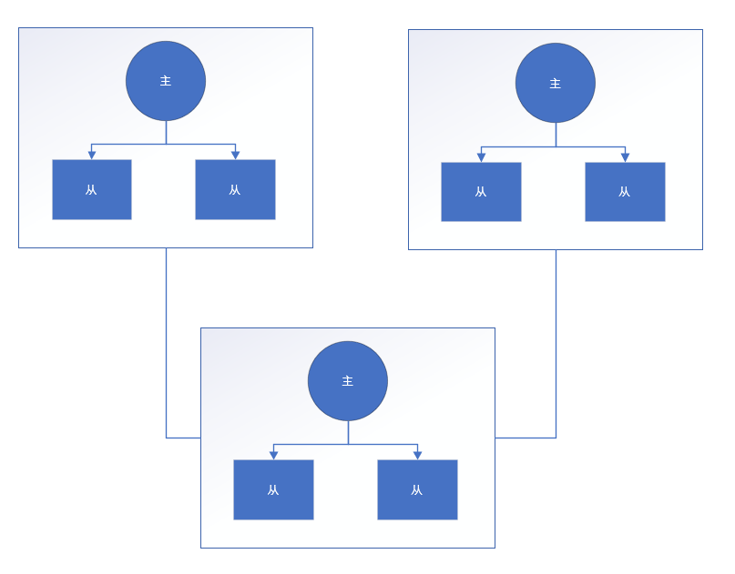
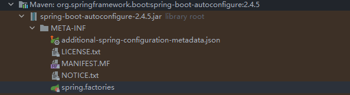
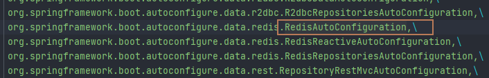
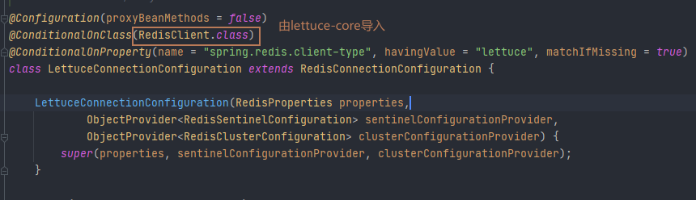
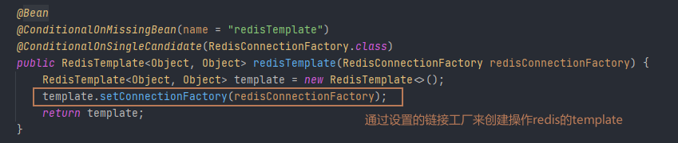

# Redis

### 一. redis配置

#### 问题

##### 1. redis分布式集群架构图及如何部署？

每个集群主机负责写入操作，当主机down掉的时候从机中自动选择一个机器作为主机，主机和从机配置在不同的机器上。



##### 2. 何时配置redis的持久化？

##### 3. 持久化快照 和 AOF如何选择？

##### 4. 最新的快照+AOF如何设置？

##### 5. 缓存穿透、缓存击穿、缓存雪崩描述及处理。

##### 6. redis秒杀场景实现的几种方式及各自的优缺点，压测通过。

##### 7. docker中配置redis需要注意的问题。

* 将配置文件统一存放管理
* 如果需要设置快照或者aof模式时，设置好文件保存位置
* 调整好容器对外相应的端口

##### 8. redis集群中键的分布。

Redis Cluster does not use consistent hashing, but a different form of sharding where every key is conceptually part of what we call a hash slot.

There are 16384 hash slots in Redis Cluster, and to compute what is the hash slot of a given key, we simply take the CRC16 of the key modulo 16384.

Every node in a Redis Cluster is responsible for a subset of the hash slots, so for example you may have a cluster with 3 nodes, where:

Node A contains hash slots from 0 to 5500.
Node B contains hash slots from 5501 to 11000.
Node C contains hash slots from 11001 to 16383.
This allows to add and remove nodes in the cluster easily. For example if I want to add a new node D, I need to move some hash slot from nodes A, B, C to D. Similarly if I want to remove node A from the cluster I can just move the hash slots served by A to B and C. When the node A will be empty I can remove it from the cluster completely.

##### 9. redis集群中还能使用事务操作吗？当不同的键存储在不同的机器上时。

Redis Cluster supports multiple key operations as long as all the keys involved into a single command execution (or whole transaction, or Lua script execution) **all belong to the same hash slot**. The user can force multiple keys to be part of the same hash slot by using a concept called *hash tags*.

##### 10. redis集群中某一集群节点主从全部down掉的情况下，集群是否还可用?

Node B1 replicates B, and B fails, the cluster will promote node B1 as the new master and will continue to operate correctly.

However, note that if nodes B and B1 fail at the same time, Redis Cluster is not able to continue to operate.

##### 11. redis不保证强一致性（可能存在写丢失）


### 二 redis配置和部署

##### 1. 设置redis.conf文件

```properties
#注释掉只能本机访问命令
#bind 127.0.0.1 -::1
#将本机保护模式设置为no
protected-mode no
#以后台方式运行
daemonize yes
#设置pid文件生成位置
pidfile /data/redis_main.pid
#设置日志文件地址
logfile "/data/redis_main.log"
#开启rdb模式备份设置
save 3600 1
save 300 100
save 60 10000
#设置备份名称
dbfilename dump-main.rdb
#设置备份目录
dir /data
#开启AOF备份
appendonly yes
#设置AOF名称
appendfilename "/data/appendonly-main.aof"
#设置AOF备份策略
appendfsync everysec
#设置最大内存使用
maxmemory 1g
```

设置通用redis-common.conf文件

```properties
#bind 127.0.0.1 -::1
protected-mode no
#docker中设置为yes，容器会自动退出
daemonize no
maxmemory 1g
```


##### 2. docker安装redis

```bash
docker run -d -p 6379:6379 -v /opt/docker_files/redis/conf:/usr/local/etc/redis -v /opt/docker_files/redis/data:/data --name redis-main redis:6.2.3 redis-server /usr/local/etc/redis/redis-main.conf
```

##### 3. 使用docker配置redis集群

* 设置docker网络方式为host：Currently Redis Cluster does not support NATted environments and in general environments where IP addresses or TCP ports are remapped.

* 配置为3台机器，每个节点按照一主一从设置

* 设置每个节点的配置文件

  ```properties
  include /usr/local/etc/redis/redis-common.conf
  
  port 6380
  pidfile /data/redis-c1-6380.pid
  logfile "/data/redis-c1-6380.log"
  save 3600 1
  save 300 100
  save 60 10000
  dbfilename dump_redis_c1_6380.rdb
  dir /data
  appendonly yes
  appendfilename "appendonly_redis_c1_6380.aof"
  appendfsync everysec
  
  #以下为集群相关配置
  cluster-enabled yes
  cluster-config-file nodes-6380.conf
  cluster-node-timeout 15000
  ```

  

* 配置3台机器每个机器设置2条启动命令（一主一从）

  ```shell
  docker run -d --net host \
  -v /opt/docker_files/redis_cluster/conf:/usr/local/etc/redis \
  -v /opt/docker_files/redis_cluster/data:/data \
  --name redis-c0-6380 redis:6.2.3 redis-server /usr/local/etc/redis/redis-c0-6380.conf
  
  docker run -d --net host \
  -v /opt/docker_files/redis_cluster/conf:/usr/local/etc/redis  \
  -v /opt/docker_files/redis_cluster/data:/data \
  --name redis-s0-6390 redis:6.2.3 redis-server /usr/local/etc/redis/redis-s0-6390.conf
  ```

  

* 将3台电脑的redis设置为集群

  ```shell
  redis-cli -p 6380 --cluster create --cluster-replicas 1 192.168.1.50:6380 192.168.1.50:6390 192.168.1.51:6380 192.168.1.51:6390 192.168.1.52:6380 192.168.1.52:6390
  ```

* 查询集群情况

  ```shell
  cluster nodes
  ```

* 使用集群方式登录

  ```shell
  redis-cli  -c –p 6380
  #docker exec -it redis-c0-6380 redis-cli -c -p 6380
  ```

### 三. redis使用

#### 1. springboot自动加载redis相关设置

```yaml
spring:
  redis:
    cluster:
      nodes: 192.168.1.50:6380,192.168.1.51:6380,192.168.1.52:6380,192.168.1.50:6390,192.168.1.51:6390,192.168.1.52:6390
      max-redirects: 5
    lettuce:
      cluster:
        refresh:
          adaptive: true
```

#### 2. 加载流程

* springboot autoconfigure，加载**RedisAutoConfiguration**自动配置类

  

  

* **RedisAutoConfiguration**  根据条件设置redis连接相关信息

  

  

  

  

  
