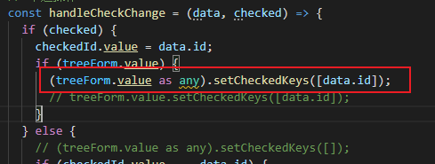
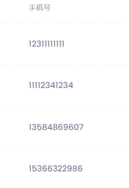

## Vue项目中遇到的

## 1. 前端问题

1. vue项目打开浏览器调试

```js
module.exports = {
  publicPath:
    process.env.NODE_ENV === "production" ? "/metronic8/vue/demo1/" : "/",
  //下面这段配置打开调试功能
  configureWebpack: {
    devtool: "source-map",
  },
};
```

2. 处理eslint自动修复代码样式

```json
//在package.json中将 lint的配置修正为以下信息，然后运行npm run lint
"lint": "eslint --fix --ext .js,.vue src"

```

3. Metronic框架修改完左侧栏需要重启应用
4. Object.assign
5. axios拦截器修改了返回类型，但是get post等还是返回 Promise<AxiosResponse> 如何解决？
6. 给reactive包裹对象赋值失败


​	正确的方法：


7. ts强类型语言下使用 as any 调用自定义组件上的方法



11. ref对象不需要赋值直接初始化传递null ``` const addEmployeeModalRef = ref<null | HTMLFormElement>(null);```，ref对象没return的情况下会出现null


如果没有如下代码：方法中获取到的ref对象是null


12. vue nextTick

13. props中的属性可以在子组件页面上直接使用，而不是必须先接收下来,在页面直接使用的时候可以不加props前缀

14. 开发手机号码输入组件

    

15. TS 组合继承（restfulapi实现 单独的pageQuery情形）的处理方式

16. 使用KTDatatable数据异步加载问题

    ```typescript
    const data = ref(props.tableData);
    //以下代码在props.tableData发生改变的时候没有执行
    //或者data.value
    watch(
        data,
        () => {
            if ("onCurrentChange" in vnodeProps) {
                currentSort.value = label.value + order.value;
            } else {
                pagination.value.total = data.value.length;
            }
        }
    );
    ```

    ```typescript
    // 以下代码会在props.tableData发生改变的时候执行
    watch(
        () => props.tableData,
        () => {
        	console.log("watch:props.tableData");
        	if ("onCurrentChange" in vnodeProps) {
            currentSort.value = label.value + order.value;
            } else {
            pagination.value.total = data.value.length;
            }
        }
    );
    ```

    

17. 一串手机号数字宽度不一样

    

18. vue 触发事件时 event对象 event.currentTarget指向事件所绑定的元素，而event.target始终指向事件发生时的元素

19. form表单里的button默认是 <font color="red">**submit**</font> 类型

20. lombok 里面的自动生成的 get set方法 在 首字母为 小写 第二个字母为大写时 和 Spring，Jackson 生成方式不同,会导致前端数据传不到后端,处理方式

    * 不用lombok手动生成get set
    * 在对应参数上加上 @JsonProperty(value = "mClivta")
    * 不使用第一个字母小写第二个字母大写 这种命名格式

    

21. mysql 分页排序的时候 需要加上 id 这种关键字作为order by字段,否则会出现分页数据重复显示的问题

22. **`v-slot` 只能添加在 `<template>` 上**

23. @update:属性名称  可以设置属性改变产生的事件

24. 从其他js引入的方法,需要return出来,然后再在页面上使用

25. 页面访问对象属性值时,并且对象是通过ajax赋值的情况下,对象初始化的时候需要设置为const car = ref({});

    不能设置成const car = ref(null);.否则页面会报 cannot read property *** of null

26. 数据多层级传递,使用provide inject

27. 数据多层级传递是 当数据是ajax获取的时候,注意在接收的页面需要 watch 传过来的数据

28. npm install -D -S -G 和不加后缀的区别

    ```bash
    # 将XXXXX包安装到node_modules下
    npm install  XXXXX
    
    # 将包安装到node_modules下
    # 在package.json的dependencies属性下添加该XXXXX包
    npm install --save XXXXX
    
    # 将包安装到node_modules下
    # 会在package.json的devDependencies属性下添加XXXXX包
    npm install --save-dev XXXXX
    
    # 安装包到全局，不会安装在当前目录下。
    npm install --global XXXXX
    ```

29. ref对象在控制台打印输出:RefImpl,reactive在控制台输出Proxy

30. 

32. 

### 3. jwt

jwt的优缺点：

### 4. async await

1. async await下的代码是同步的吗？

   是的，会等待promise执行完成再往下继续执行。

2. 如何等待一个Promise执行完成？（指这个方法执行完时，里面所以的异步也已经执行完成）。

3. finally如何实现

### 5. Bootstrap5

1. vue 中 使用bootstrap5 modal时，判断modal显示时，使用：

   

2. 通过响应点击事件的方式打开modal，因为打开modal对话框时经常需要做一些前置判断。

   ```typescript
   //1 在onMounted函数中保存modal对象
   onMounted(() => {
       if (addEmployeeModalPRef.value) {
       	// 保存modal对象
       	myModal = new Modal(addEmployeeModalPRef.value.$el);
       }
   });
   //2 在需要打开对话框的地方执行 myModal.show();
   const handelRowEdit = (employee) => {
        myModal.show();
   };
   ```

   

3. 

### 6. element-plus

1. 自定义元素增加element-plus验证

   

   ```html
   <!--end::Label-->
   //将自定义组件包裹到 el-form-item 标签中
   <el-form-item prop="departmentId">
       <treeselect
                   v-model="formData.departmentId"
                   :multiple="false"
                   :options="departments"
                   :default-expand-level="1"
                   />
       <!-- <div class="el-form-item__error" >部门必填</div> -->
   </el-form-item>
   ```

   

2. tree组件(实现单选功能时)：

   网络单选树代码分析

   ```typescript
   // 单选操作
   handleCheckChange(data, checked) {
       if (checked) {
           this.checkedId = data.id;
           this.$refs.treeForm.setCheckedKeys([data.id]);
       } else { // 这一段代码的作用是，当已选择节点再次点击的时候，让该节点仍然保持被选中状态
           if (this.checkedId === data.id) {
               this.$refs.treeForm.setCheckedKeys([data.id]);
           }
       }
   }
   ```

   

   问题主要是产生在实现：可点击的禁用节点

   * check-change 事件会在节点状态改变的时候触发（选中，取消都会触发）
   * check-change 事件会在 setCheckedKeys 调用的时候触发（需要在nextTick后调用），***但是在check-change事件内部好像不会触发***
   * node-click 事件在 setCheckedKeys 调用的时候**不会**触发，（可用于选择禁用节点时使用）
   * node-click 事件在子节点已经点击的情况下，点击父节点不会触发~~，注：根本原因是node click只在点击节点内容时触发，点击复选框时不会触发
   * **总结**：实现可点击选中的禁用单选树时

   ```typescript
   const handleCheckChange = (data, checked) => {
       console.log("handleCheckChange", data.label, checked);
       if (checked) {
           currentSelectedNode.value = data;
           checkedId.value = data.id;
           // if (treeRef.value) {
           (treeRef.value as any).setCheckedKeys([data.id]);
           // treeRef.value.setCheckedKeys([data.id]);
           // }
       } else {
           // (treeRef.value as any).setCheckedKeys([]);
           if (checkedId.value === data.id) {
               (treeRef.value as any).setCheckedKeys([data.id]);
           }
       }
   };
   const handleCheck = (data) => {
       console.log("handleCheck", data);
   };
   const handleNodeClick = (data, node) => {
       console.log("handleNodeClick", data.label);
       if (node.disabled) {
           checkedId.value = data.id;
           console.log("handleNodeClick", node);
           (treeRef.value as any).setCheckedKeys([data.id]);
       }
       // console.log("handleNodeClick", node);
       // (treeRef.value as any).setCheckedKeys([data.id]);
       // checkedId.value = data.id;
       // current
       SelectedNode.value = data;
   };
   ```

   * 其余：

      1. 在 getDepartmentTreeData 方法里, 不设置checkedId.value = treeNode.data.id; 会出现编辑的时候触发handleCheckChange方法。自动选中编辑节点

         ```typescript
         const getDepartmentTreeData = async () => {
             const response = await DepartmentService.search();
             console.log("result", response.data.obj);
             departmentTree.value = response.data.obj;
             await nextTick();
             // (treeRef.value as any).setCheckedKeys([2]);
             console.log("Now DOM is updated");
             const treeNode = (treeRef.value as any).getNode(2);
             // checkedId.value = treeNode.data.id;
             currentSelectedNode.value = treeNode.data;
             (treeRef.value as any).setCheckedKeys([2]);
         };
         ```

         

      2. 但是在删除节点的时候又正常选中了2号节点？应该是删除后得节点不会再触发check-change事件。
   
3. DatePicker,

   * 传递时间短8个小时需要设置 value-format 的值 value-format="YYYY-MM-DD"或者 value-format="YYYY-MM-DD HH:mm:ss"

   * 设置value-format属性后,日期回显(编辑数据显示日期),需要格式化日期到value-format设置的格式才能正确显示

   * 判断到底是前端还是后端问题时,查看前端的网络接口请求.

     

   * ```java
     后端接收日期时jackson注意设置正确的时区
     @JsonFormat(pattern = "yyyy-MM-dd HH:mm" ,timezone="GMT+8")
     ```

4. Pagination分页设置

   至少需要设置的属性有:

   * layout="prev, pager, next" (设置`prev`表示上一页，`next`为下一页，`pager`表示页码列表)
   * :pager-count="7" (设置显示页面个数 1 2 3 4 5 6... 20)
   * :page-size="12" (每页显示记录数)
   * :total="tableTotal"(总记录数)
   * @update:currentPage="pageChange"(切换页码后需要执行的函数,用于请求新页面数据)

5. 使用el-icon

   * 安装 npm install @element-plus/icons

   * 引入并注册

     ```typescript
     import { createApp } from 'vue'
     import App from './App.vue'
     import ElementPlus from 'element-plus'
     import * as ElIcons from '@element-plus/icons'
     
     const app = createApp(App)
     for (const name in ElIcons){
     	app.component(name,(ElIcons as any)[name])
     }
     
     app.use(ElementPlus).mount('#app')
     ```

   * 页面使用

6. el-select远程搜索回显时(编辑)设置值

   * 将`v-model="formData.applyEmployeeId"`的值设置好
   * 使用要显示的 字 调用 远程搜索方法

7. 

### 7. vue-treeselect

	1.  控制台报 Property "$createElement" was accessed during render but is not defined on instance警告
	2.  通过代码设置value为 undefined 不能清除页面上的选择
### 8. ant-design-vue

1. 引入ant-design-vue的组件css后会修改body的背景色，在default.less中修改background-color

   


### 9. 项目中遇到的问题(未解决)

1. bootstrap5 nav 延迟加载数据

2. 将pDelete移入父类

3. bootstrap5创建modal对象时:

   ```typescript
   // HTMLFormElement 这个对象下面才有$el,否则下面使用需要 //(carApplicationDetailModalPRef.value as any).$el
   const carApplicationDetailModalPRef = ref<null | HTMLFormElement>(null);
   
   onMounted(() => {
       setCurrentPageBreadcrumbs("车队管理", ["派车管理", "申请单列表"]);
       if (carApplicationDetailModalPRef.value) {
           console.log(carApplicationDetailModalPRef.value);// 输出Proxy
           console.log(carApplicationDetailModalPRef.value.$el);//输出 div
           myModal = new Modal(carApplicationDetailModalPRef.value.$el);
       }
   
       console.log(myModal);
   }); 
   ```


### 10. 项目上线注意事项

1. 服务器设置:
   * 设置图片存储位置 application.properties 里的 image.save_real_dir配置项
   * 设置图片服务器启动的地址和端口:application.properties 里的 image.domain配置项
2. 后台网页项目设置:
   * 设置 core 目录下的 SystemConfig.ts 文件中的 图片上传地址
3. 

## 2.JAVA问题

1. spring boot 读取classpath 下文件

```java
//正确
InputStream in1 = this.getClass().getResourceAsStream("/templates/a.xlsx");
System.out.println(in1);
//正确
InputStream in2 = this.getClass().getClassLoader().getResourceAsStream("templates/a.xlsx");
System.out.println(in2);
//正确
InputStream in3 = Thread.currentThread().getContextClassLoader().getResourceAsStream("templates/" + "a.xlsx");
System.out.println(in3);
//正确
InputStream in4 = ExcelTemplateUtils.class.getResourceAsStream("/templates/a.xlsx");
System.out.println(in4);
//错误!!!
InputStream in5 = ExcelTemplateUtils.class.getResourceAsStream("templates/a.xlsx");
System.out.println(in5);
//正确
//正确
ClassPathResource classPathResource = new ClassPathResource("templates/" + "a.xlsx");
InputStream in6 = classPathResource.getInputStream();
System.out.println(in6);
//正确
ClassPathResource classPathResource2 = new ClassPathResource("/templates/" + "a.xlsx");
InputStream in7 = classPathResource2.getInputStream();
System.out.println(in7);

java.io.BufferedInputStream@5e2ce7ad
java.io.BufferedInputStream@7bcb7714
java.io.BufferedInputStream@5394e0f1
java.io.BufferedInputStream@6a40c9ca
null
java.io.BufferedInputStream@4a136041
java.io.BufferedInputStream@3e74929a
```

2. 下载excel文件

   * 前端部分代码

     ```
     public static download(url: string): Promise<AxiosResponse> {
         return ApiService.vueInstance.axios.post(url, {}, { responseType: "blob" });
     }
     const downloadTemplate = () => {
         ApiService.download(
             "http://localhost:8088/admin/secure/download/template"
         ).then((res: any) => {
             const stream: any = res.data; // 后端用stream返回Excel文件
             const blob: any = new Blob([stream]);
             if (res.status !== 200) {
                 // 非正常业务码，执行错误处理
                 // 注意：status字段名是团队自行定义的
             }
             const contentDisposition = res.headers["content-disposition"];
             //解决中文乱码
             const fileName = decodeURIComponent(
                 contentDisposition.split(";")[1].split("=")[1]
             );
             // 前端获取业务码，成功执行正常业务
             const downloadElement = document.createElement("a");
             const href = window.URL.createObjectURL(blob); // 创建下载的链接
             downloadElement.href = href;
             downloadElement.download = fileName; // 下载后文件名
             document.body.appendChild(downloadElement);
             downloadElement.click(); // 点击下载
             document.body.removeChild(downloadElement); // 下载完成移除元素
             window.URL.revokeObjectURL(href); // 释放掉blob对象
         });
     };
     ```

   * 后端部分

     * 设置"content-disposition"前端接收不到问题,后端需要设置: `response.setHeader("Access-Control-Expose-Headers", "Content-Disposition");

     * 文件名称中文乱码问题,同时需要前端解码配合

       ```java
       outFileNam = URLEncoder.encode(outFileNam, "UTF-8");
       outFileNam = new String(outFileNam.getBytes(StandardCharsets.UTF_8), StandardCharsets.ISO_8859_1);
       ```
   
3.  http 400 错误,可能是开发工具造成的,排除方法:

   * 复制别的接口替换当前接口,发送请求看是否还是400

4. 

## 3. vee-validate、yup

## 4. TypeScript

1. ！！

   ```typescript
   var o={flag1:true};   
   var test1=!!o.flag1 //等效于var test1=o.flag1||false;  
   ```

2. ！. ts中！作为后缀是Non-null Assertion Operator，表示!前的值一定不是**<font color=red >null</font>**或者**<font color=red >undefined</font>**

```ts
submitButton.value!.disabled = true;
```

3. ?.

表示对象可能是 'undefined'

```typescript
// Error - might crash if 'obj.last' wasn't provided!
console.log(obj.last.toUpperCase());

console.log(obj.last?.toUpperCase());//会编译为以下js代码
->console.log((_a = obj.last) === null || _a === void 0 ? void 0 : _a.toUpperCase());
```

4. 接口
5. 类
6. Partial<T> 可以快速把某个接口类型中定义的属性变成可选的(Optional)

## 5. Metronic 8.1.8

### 5.1 项目配置

1. 登录：

   * src\core\services\JwtService.ts 本地存储token的方式修改为sessionStorage
   * src\stores\auth.ts 修改login http请求
   * src\views\crafted\authentication\basic-flow\SignIn.vue 修改登录逻辑

2. 路由相关：

   * src\main.ts 里加载了 src\router\index.ts 配置的路由信息

     ```typescript
     import router from "./router";
     app.use(router);
     ```

   * src\router\index.ts 中配置了路由信息和导航守卫

   * 修改定义的routes路由信息

3. 左侧菜单：

   * src\core\config\MainMenuConfig.ts 配置菜单
   * src\layouts\main-layout\sidebar\SidebarMenu.vue 读取菜单信息并展示到左侧页面
   * src\layouts\main-layout\header\menu\MenuPages.vue 读取菜单信息并展示到上方页面

4. 页面布局样式配置：

   * 修改项目的配置样式：src\core\config\DefaultLayoutConfig.ts，配置修改后不生效原因：因为已将配置信息存储到浏览器存储中。

5.  

### 5.2 其他问题

1. import 导入的数据，在页面没有刷新的情况下不会重新读取。

   在UserMenuConfig里导出了从后端获取的数据,但当后端数据发生改变的时候，页面不刷新的情况下不会重新执行import导入。

   解决方式：由原来的导出数据改为导出获取数据的函数。

2. 项目绑定在vue上的对象axios偶尔会发生丢失的问题。

   ```typescript
   //main.ts
   ApiService.init(app);
   
   //ApiService 中的 init函数
   ApiService.vueInstance = app;
   ApiService.vueInstance.use(VueAxios, axios);
   
   //控制台偶尔会报axios找不到。可能是开发环境热加载引起的问题。
   //TypeError: Cannot read properties of undefined (reading 'axios')
   ```

3. 项目中这两个文件不存在

   http://media/misc/auth-bg.png
   http://media/stock/900x600/42.png

4. google font加载不到处理

   fonts.googleapis.com -> fonts.font.im

5. 
