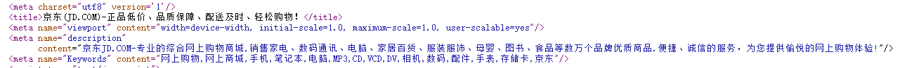

# html5+css

## PC端

### 1.问题

* 多个display：inline-block没有文字时：

  当其中一个加入文字是整个块向下方移动

  原因是：默认对齐方式是对齐的baseline

* inline-block元素之间会有细小的缝隙

* 让浮动元素不换行（给浮动块设置左右边距时，最后一个元素不清除右边距的情况）给父元素宽度设置

### 2.基本SEO

* TDK三大标签

  

  + title
    + 网站名称+网站介绍（不超过30字）
  + description
    + 网站总体业务和主题概括，多采用“我们是...”、“我们提供...”、“xxx网作为...”、“电话：...”
  + keyword
    + 6-8个关键词，关键词之间用英文逗号分隔

* LOGO
  * logo里面首先放一个h1标签，目的是为了提高权重，让搜索引擎知道这里很重要
  * h1里放一个链接，可以返回首页
  * 方便搜索引擎收录，链接里面要放文字（网站名称），但是文字不要显示出来
    + text-index: -9999px,然后overflow:hidden。
    + font-size:0; 
     * 给链接一个title属性
    
    

## 移动端

### 布局方案：

* 百分比布局
* flex弹性布局
* less+rem+媒体查询布局
* 混合布局