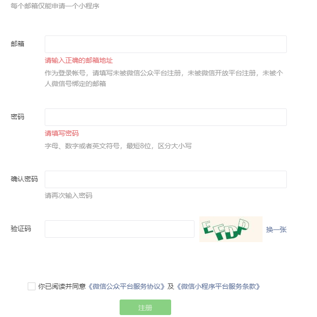
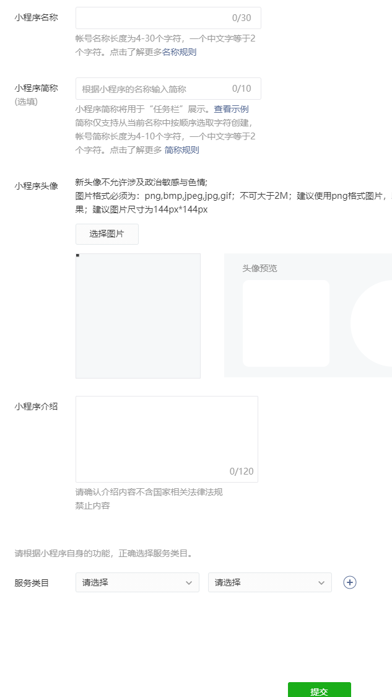

### 小程序开发前期准备

#### 一 注册小程序账号：

1. 注册地址：https://mp.weixin.qq.com/wxopen/waregister?action=step1&token=&lang=zh_CN

   相关说明：

   * **一个账号对应一个小程序**
   * **企业、政府、媒体其他组织可以注册50个小程序**
   * **个体户和个人类型可注册5个小程序**

   

2. 绑定管理员信息，管理员需要绑定微信支付，做过微信实名信息认证。

3. 完善小程序相关信息。

